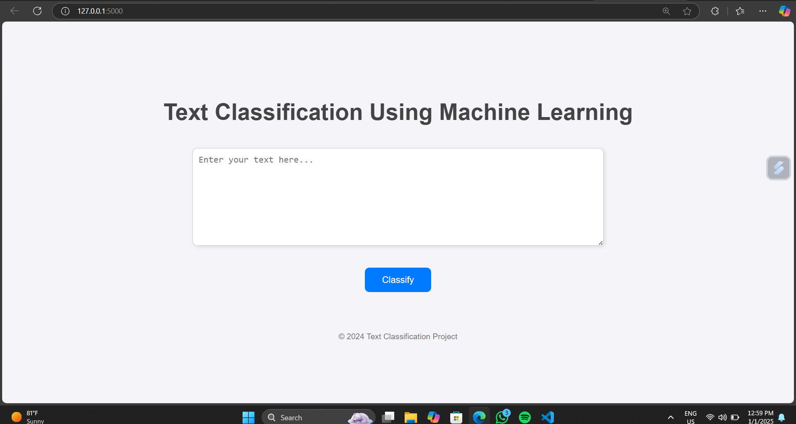

# Text Classification Using Machine Learning

## 📊 Project Overview
This project focuses on classifying textual data using machine learning techniques. The goal is to provide a web-based application where users can input text, and the application classifies it using trained machine learning models. The project uses a combination of frontend and backend technologies for an interactive and efficient user experience.

## 🔧 Features
1. **Frontend**: Built using HTML, CSS, and JavaScript for a responsive and user-friendly interface.
2. **Backend**: Developed with Python and Flask for handling requests and integrating machine learning models.
3. **Machine Learning Models**:
   - Multinomial Naive Bayes (MNB)
   - Complement Naive Bayes (CNB)
   - Support Vector Classifier (SVC)
4. **Accuracy**:
   - MNB: 96%
   - CNB: 98%
   - SVC: 98%

## 📚 Technologies Used
- **Frontend**: HTML, CSS, JavaScript
- **Backend**: Python, Flask
- **Machine Learning**: scikit-learn

## 🔀 Project Structure
```
text-classification-ml/
|— static/
|   |— css/
|   |— js/
|   |— screenshots/
|       |— homepage.png
|— templates/
|   |— index.html
|— models/
|   |— mnb_model.pkl
|   |— cnb_model.pkl
|   |— svc_model.pkl
|— app.py
|— requirements.txt
|— LICENSE.md
|— README.md
```

## 🚀 Installation and Setup
1. Clone the repository:
   ```bash
   git clone https://github.com/your-username/text-classification-ml.git
   cd text-classification-ml
   ```

2. Create and activate a virtual environment (optional but recommended):
   ```bash
   python -m venv venv
   source venv/bin/activate  # On Windows: venv\Scripts\activate
   ```

3. Install dependencies:
   ```bash
   pip install -r requirements.txt
   ```

4. Run the Flask application:
   ```bash
   python app.py
   ```

5. Open your browser and go to `http://127.0.0.1:5000/`.

## 🔧 Usage
1. Enter the text you want to classify in the input text area.
2. Select the desired classifier (MNB, CNB, or SVC).
3. Click the "Classify" button to see the result.

## 🔢 Results
The application displays the predicted class of the input text based on the selected classifier. The classifiers achieve the following accuracies:
- **MNB**: 96%
- **CNB**: 98%
- **SVC**: 98%

## 🖼️ Screenshots
**Homepage:**


## 💡 Future Improvements
1. Add support for additional machine learning models.
2. Improve the frontend design for better user experience.
3. Enable user-uploaded datasets for classification.
4. Deploy the application on cloud platforms like AWS or Heroku.

## 🙏 Contributing
Contributions are welcome! If you'd like to contribute, please fork the repository and create a pull request.

## 🔒 License
This project is licensed under the MIT License. See the [LICENSE.md](LICENSE.md) file for details.

## 📢 Contact
For any inquiries or feedback, please contact:
- **Email**: vinay050805@gmail.com
- **GitHub**: [VINAY050805](https://github.com/VINAY050805)

